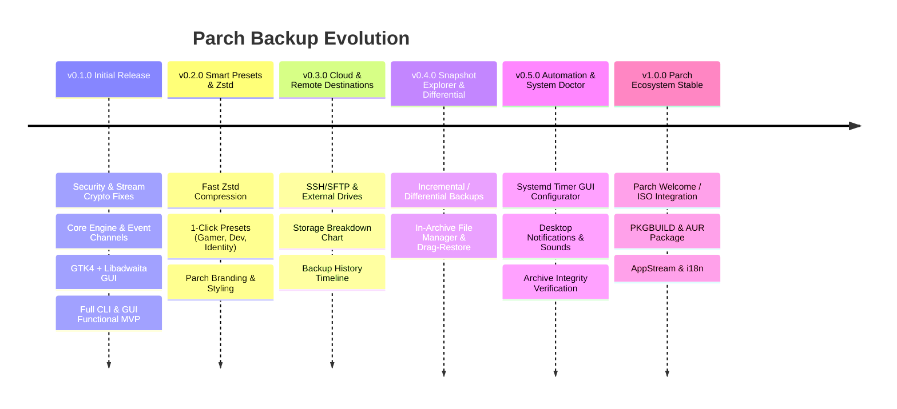

# Parch Backup: Development Roadmap (v0.1 → v1.0)

This roadmap outlines the phased development of **Parch Backup**, bringing the **GTK4 + Libadwaita (GNOME HIG) GUI directly into the v0.1.0 initial release**, and expanding into a feature-rich, high-powered backup & snapshot solution for Parch Linux up to v1.0.0.

---

## 🚀 Versioned Phases

---

### Phase 1: v0.1.0 — Initial Release: Core Engine Fixes & GTK4/Libadwaita GUI (MVP)
> **Goal**: Fix critical crypto/OOM bugs and launch both the CLI and a fully functional, modern GTK4/Libadwaita GUI following GNOME HIG.

- **Backend Engine & Security Fixes**:
  - [ ] **AES-256-GCM Security Fix**: Prepend `PBAR` magic header + random 16-byte salt + random 12-byte nonce per archive to prevent GCM static nonce reuse.
  - [ ] **Streaming Encryption/Decryption**: Stream crypto operations using chunked reader/writer to support 100GB+ archives without RAM OOM.
  - [ ] **Flatpak Fix**: Update query to `flatpak list --app --columns=app` to produce clean Application IDs.
  - [ ] **Package Manager Fallback**: Auto-detect `paru` → `yay` → `pacman`.
  - [ ] **Restore Logic Fix**: Read `PBAR` magic header to identify encrypted files; remove destructive post-restore re-encryption.
  - [ ] **Async Progress Event Channels**: Implement `ProgressEvent` channels (`Sender<ProgressEvent>`) to stream live progress updates to CLI & GTK UI.
  - [ ] **CLI Default Path**: Default archive path to `~/Backups`.
- **GTK4 + Libadwaita (GNOME HIG) GUI**:
  - [ ] **Main Window (`AdwApplicationWindow`)**: HeaderBar, ViewSwitcher (`Backup` & `Restore` views).
  - [ ] **Backup Preferences Page**: `AdwSwitchRow` for Apps, Flatpaks, Home, Keys; Destination Folder chooser; Password Entry row.
  - [ ] **Restore Page**: Archive File Selector, Password Entry (shown if `PBAR` header is encrypted), Restore Action button.
  - [ ] **Live Progress Overlay**: Real-time progress bar (`GtkProgressBar`), status labels, and cancellation support.

---

### Phase 2: v0.2.0 — Smart Presets, Zstd & Parch Styling
> **Goal**: Supercharge backup speeds with `zstd` and introduce 1-click tailored backup profiles.

- [ ] **Multi-Threaded Zstd (`tar.zst`)**: Fast compression with `zstd` crate (5x faster than gzip).
- [ ] **1-Click Smart Presets**:
  - 🎮 **Gamer Preset**: Save games, Steam configs, Lutris/Heroic data, MangoHud profiles.
  - 💻 **Developer Preset**: VS Code/VSCodium extensions & settings, Neovim config, SSH/GPG keys, shell dotfiles (`.zshrc`, `.bashrc`).
  - 🌐 **Full System Identity**: Installed apps, Flatpaks, systemd enabled services, fonts, and dotfiles.
- [ ] **Parch Linux Theme & Aesthetic**: Custom GTK accent matching Parch Linux colors, dark mode optimization, subtle micro-animations.

---

### Phase 3: v0.3.0 — Cloud & Remote Destinations + Backup History
> **Goal**: Expand backup storage options beyond local disk to SSH servers, external mounts, and cloud.

- [ ] **Remote & SSH Destinations**: Back up directly over SSH/SFTP or custom mount points.
- [ ] **Visual Storage Breakdown**: Chart showing space taken by Packages, Flatpaks, Home, and Keys.
- [ ] **Backup History Timeline**: List past backups, showing archive sizes, creation dates, and component tags.

---

### Phase 4: v0.4.0 — Snapshot Explorer & Differential Backups
> **Goal**: Save storage space with differential backups and allow browsing inside archives.

- [ ] **Differential / Incremental Backups**: Only back up modified files since the last baseline backup.
- [ ] **In-Archive File Manager**: Inspect files inside `.pbar` / `.tar.zst` archives directly within the GUI without extracting everything.
- [ ] **Selective File Restore**: Drag & drop or 1-click restore individual files or directories from inside an archive.

---

### Phase 5: v0.5.0 — System Automation & Health Doctor
> **Goal**: Automatic background execution and archive integrity verification.

- [ ] **Systemd Timer GUI Configurator**: Toggle and schedule daily/weekly automated backups inside the GUI preferences.
- [ ] **Desktop Notifications**: Send Freedesktop notifications on backup completion or failure with quick summary details.
- [ ] **System Doctor**: 1-Click archive integrity check (checksum verification & test decryption).

---

### Phase 6: v1.0.0 — Production Release & Parch Ecosystem Integration
> **Goal**: Official stable 1.0 release ready for default inclusion in Parch Linux ISOs.

- [ ] **Parch Welcome Integration**: Deep integration with Parch Linux Welcome application ("Welcome to Parch Linux! Restore your backup").
- [ ] **AUR & Parch Package (`PKGBUILD`)**: Official PKGBUILD script for `parch-backup`.
- [ ] **AppStream & Desktop Integration**: `.desktop` launcher, SVG app icon, AppStream metadata XML, man pages (`parch-backup.1`), and i18n translation support.
